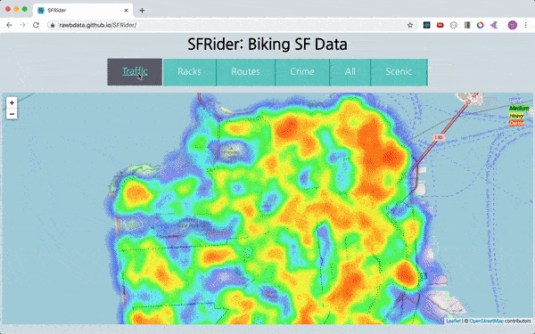
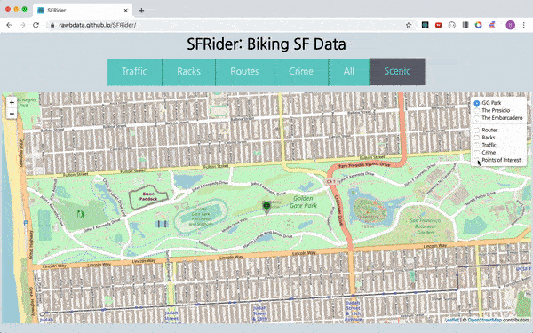

# SFRider
[SFRider Live](https://rawbdata.github.io/SFRider/ "SFrider")

_A data visualization map that lets bicyclists see the relevant data regaring their rides in San Francisco_


***
## Background and Overview
***

SFRider will be single web react web-app that utilizes OpenSF data to visualize the best times and areas to ride, park, and avoid dangerous intersections in San Francisco. The map will have multiple overlays that depict routes, accidents, density, traffic and more.


# SFRider


_A single page react map utilizing react-leaflet to display San Francisco bicycling data._

[SFRider Live](https://rawbdata.github.io/SFRider/ "SFrider")




***
## Background and Overview
***

SFRider is a single page React app utilizing city data obtained through OpenSF. 


- Contemporary: Uses the most modern datasets to display geolocated data regarding key bicycle data.

- Seamless: Markers, Popups, and Routes are displayed on the map in functional ways

- Fluid: Traffic uses a multi-colored heatmap to display which areas are most effected


SFRider is a single page React app to showcase a fundamental understanding of HTML, Javascript, and React

***
## Functionality
***

- [ ] Users can select which map to view

    ```javascript
     <div className="tab">
        <input type="radio" 
                name="css-tabs" 
                id="tab-1" 
                defaultChecked={this.state.mainMapSelection==="traffic"} 
                className="tab-switch"
                onClick={()=>{this.changeMap("traffic")}}
        />
        <label htmlFor="tab-1" className="tab-label">Traffic</label>
    </div>

    <div className="tab">
        <input type="radio" 
                name="css-tabs" 
                id="tab-2" 
                defaultChecked={this.state.mainMapSelection==="racks"} 
                className="tab-switch"
                onClick={()=>{this.changeMap("racks")}}
        />
        <label htmlFor="tab-2" className="tab-label">Racks</label>
    </div>

    ```

- [ ] Utilizes React-Leaflet Overlays and Baselayers for easy data visualization selection

    ```html
        <BaseLayer name="Black and White">
            <TileLayer
            attribution='&amp;copy <a href="http://osm.org/copyright">OpenStreetMap</a> contributors'
            url="https://tiles.wmflabs.org/bw-mapnik/{z}/{x}/{y}.png"
            />
        </BaseLayer>

        <Overlay checked name="Routes">
            <LayerGroup>

            {routes.paths.map(path=>(   
                <FeatureGroup key={path.cnn + (Math.floor(Math.random()*10000)*Math.floor(Math.random()*10000))} color="green">
                <Popup>Bicycle paths (Class I) are off-street paved bikeways. They are separated from vehicle traffic, but are almost always shared with pedestrians</Popup>
                <Polyline opacity={.35} color="lime" positions={path.shape.coordinates} />
                </FeatureGroup>
            ))}
            
            {routes.lanes.map(path=>(   
                <FeatureGroup key={path.cnn + (Math.floor(Math.random() *10000)*Math.floor(Math.random()*10000) )} color="orange">
                <Popup>A standard bike lane (Class II) is a portion of road reserved for the preferential or exclusive use of people biking, indicated by road markings.</Popup>
                <Polyline opacity={.35} color="orange" positions={path.shape.coordinates} />
                </FeatureGroup>
            ))}
            
            {routes.routes.map(path=>(   
                <FeatureGroup key={path.cnn + (Math.floor(Math.random() *10000)*Math.floor(Math.random()*10000) )} color="purple">
                <Popup>Shared lanes (Class III - sharrows) are typically wide travel lanes shared by bicyclists and vehicles.</Popup>
                <Polyline opacity={.35} color="purple" positions={path.shape.coordinates} />
                </FeatureGroup>
            ))}

            {routes.seperated.map(path=>(   
                <FeatureGroup key={path.cnn + (Math.floor(Math.random() *10000) )} color="blue">
                <Popup>Separated bikeways (Class IV), also commonly referred to as cycle tracks or protected bikeways, are bicycle facilities that are separated from traffic by parked cars, safe-hit posts, transit islands or other physical barriers.</Popup>
                <Polyline opacity={.35} positions={path.shape.coordinates} />
                </FeatureGroup>
            ))}

            </LayerGroup>
        </Overlay>
    ```
    
- [ ] Maps are drawn using leaflet funcionality
- [ ] Data is pulled and shaped before being displayed
    ```javascript
    //fetch Bicyle routes location
    fetch("https://data.sfgov.org/resource/a5zr-cehj.json")
    .then(results=> {return results.json()})
    .then(data1=>{
      let routes = {};
      routes.lights = data1;
      fetch("https://data.sfgov.org/resource/ygmz-vaxd.json")
      .then(results=> {return results.json()})
      .then(data2=>{
        routes.paths = [];
        routes.lanes = [];
        routes.routes = [];
        routes.seperated = [];
        for (let i = 0; i < data2.length; i++) {
          const ele = data2[i];
          for (let j = 0; j < ele.shape.coordinates.length; j++) {
            const coordEle = ele.shape.coordinates[j];
            let longitude = coordEle[0];
            let latitude = coordEle[1];
            ele.shape.coordinates[j] = [latitude,longitude];
          }
          switch (ele.symbology) {
            case "BIKE ROUTE":
              routes.routes.push(ele);
            break;

            case "BIKE PATH":
              routes.paths.push(ele);
            break;

            case "SEPARATED BIKEWAY":
              routes.seperated.push(ele);
            break;
          
            default:
              routes.lanes.push(ele);
            break;
          }
        }


        this.setState({
          routes: routes,
        })
      })
    })
    ```

<!--  -->


### Bonus Features
- [ ] Scenic route showcases three iconic San Francisco locations with special points of interest and relevant biking data
    <!--  -->


***
## Challenges
The most challenging aspects of this project are:
- [] Avoiding oversaturating the map by sampling data instead of dumping all of it
- [] Smooth marker and popup loading with relavent information
- [] Path drawing and differentiation
***


***
## UI/UX
***

The goal is to create a unique user experience that is intuitive to use and quick to understand. Users can select which map to display and then drill down into the data in specific areas of the map.


The all and scenic maps allow the users to overlay various data maps to curate their own experience

All data should be correlated with up to date data to ensure accuracy before embarcing on a journey.

***
## Overall Project Experience
***

This project was alot of fun to do because of my passion for bicycle riding around san francisco. Being able to gather the relevant data and display it was quite an interesting task. Seeing this data has already made me rethink how and where I should be riding my bike in SF
***
## Creator
***

Benjamin Rawner


